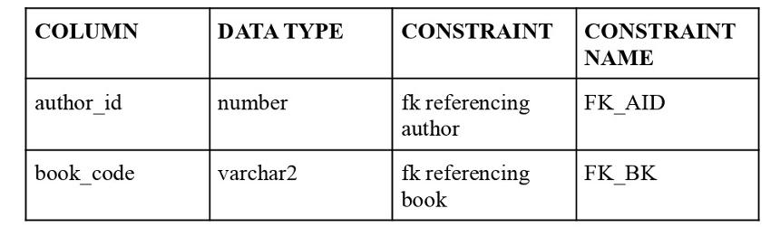

# Library-Management-System

## Project Description
The Library Management System is an automated system designed to manage and maintain the daily operations of a library. This system aids in managing books, faculty, students, and staff, streamlining processes like book checkouts, returns, and member management.

## Features
### General User Features
- **Book Information Management:** Users can provide, search, add, and update book-related information in the database.
- **Book Availability:** Users can check if a book is available before issuing, with real-time updates on availability.
- **Transaction Handling:** Management of book issuing and returns, including automatic fine calculation for overdue books.

### Administrative Features
- **User and Staff Management:** Admins can view and manage details for all users, including students, faculty, and staff.
- **Comprehensive Reporting:** Ability to generate detailed reports on book usage, user activity, and inventory status.

## Functional Requirements
- **Book Management:** Users must be able to add, update, query, and delete book information.
- **Issue Tracking:** The system should track each book issued, including the user details and due dates.
- **Fine Calculation:** Automatically calculate and impose fines based on the return date of the books.

## Requirements

Author


Faculty


Issue by Student


Issue by Faculty


Librarian


Periodicals


Staff


Student


Writes


Book


## Detailed Diagrams
ER Diagram


Schema Diagram


### SQL Queries
1. To select name, designation, and date of joining of staff
   

2. To select the name of books and author of the books.
   
   

3. To select periodicals released in the month of ‘Dec’.
   

4. To find the fine on each student.
   

5. To find the number of books issued by students in ascending order.
   

### PL/SQL Queries
1. To display the name of the book, rack number, and number of books available.
   
   

2. To find the fine from issue date and return date.
   

3. Create a trigger to add details of staff when they leave the job or when updates are needed.
   


## Technologies Used
- **SQLPlus:** For database management.

### Prerequisites
- Oracle SQLPlus
- Git (for version control)

### Installation Steps
1. **Clone the repository**
   ```bash
   git clone https://github.com/imaadiiii/Library-Management-System.git
   ```
2. **Navigate to the project directory**
   ```bash
   cd LibraryManagementSystem
   ```
3. **Set up the database**
   ```sql
   sqlplus username/password @setup.sql
   ```
4. **Run the application**
   ```bash
   python app.py
   ```

## How to Contribute
Interested in contributing? Great! Here are a few ways you can help out:
1. **Report Bugs** - Create an issue detailing the bug and steps to reproduce it.
2. **Suggest Enhancements** - Have ideas on how to make the system better? Let us know!
3. **Submit Pull Requests** - Fork the repository, make your changes, and submit a pull request.


## License
This project is licensed under the MIT License 

## Authors
- Aditya Raj


## Contact Information
- **Aditya Raj** - *adityaraj006005@gmail.com* - Feel free to contact me!

## References
- [Oracle SQLPlus Documentat](https://www.oracle.com/database/technologies/)
- [Python Documentation](https://www.python.org/doc/)
```
